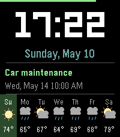

# Agenda

A Pebble Time 2 (Emery) watchface that displays time, weather, and your next calendar event.



## Features

- **Large digital clock** using the LECO 60 font
- **Date display** with day of the week
- **7-day weather forecast** with programmatically drawn weather icons and temperatures, powered by [Open-Meteo](https://open-meteo.com/) (no API key required)
- **Current weather** for today (highlighted column) showing real-time temperature and conditions
- **Next calendar event** with title and date/time, supporting up to 3 ICS calendar feeds (e.g. personal, work, shared). Timed events are prioritized over all-day events.
- **Battery indicator** bar at the top, color-coded (green/yellow/red)
- **Configurable settings** via [Clay](https://github.com/nicram02/pebble-clay) for temperature unit (Fahrenheit/Celsius), up to 3 calendar ICS URLs, and leading zero preference
- Automatic data refresh every 30 minutes

## Setup

### Prerequisites

- [Pebble SDK](https://developer.rebble.io/developer.pebble.com/sdk/index.html) with emery platform support
- Node.js (for Clay dependency)

### Build and Install

```bash
pebble build
pebble install --phone <IP_ADDRESS>
```

Or for the emulator:

```bash
pebble install --emulator emery
```

### Configuration

Open the watchface settings on your phone to configure:

1. **Temperature Unit** - Toggle between Fahrenheit and Celsius
2. **Calendar ICS URLs** (up to 3) - Paste your Google Calendar secret ICS addresses
   - Google Calendar > Settings > Your calendar > "Secret address in iCal format"
   - Leave unused fields empty — they are ignored

## Technical Details

- **Platform:** Pebble Time 2 (Emery, 200x228, 64-color)
- **SDK:** Pebble SDK 3
- **Weather API:** Open-Meteo free tier (current conditions + 7-day daily forecast)
- **Calendar:** ICS/iCal format parser with support for multiple feeds, recurring events (DAILY, WEEKLY, MONTHLY, YEARLY), EXDATE exclusions, and all-day events. Timed events take priority over all-day events.
- **Settings:** [@rebble/clay](https://www.npmjs.com/package/@rebble/clay) configuration framework

## License

MIT
